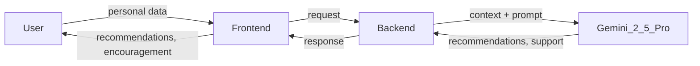

# Wellness Sanctuary with Benji

An AI agentic agent that helps you manage every aspect of your daily life: personal trainer, advocate, and support, no matter your circumstances.

## Overview

Benji is an AI agentic agent that takes your personalized information and acts as a continuous partner for daily life. It delivers recommendations, encouragement, and support so you can reach your goals. Built for everyone, Benji acts as a personal trainer, advocate, and support regardless of your circumstances, whether you are focused on health, fitness, habits, mental wellness, or something else. The experience is inclusive, supportive, and goal-oriented.

## Problem and Motivation

- People often struggle with consistency, accountability, and personalized guidance when working toward their goals.
- Generic apps rarely adapt to each person's context, goals, and constraints.
- Many people lack access to a dedicated coach or advocate who can respond to their unique situation.

Benji exists to address these gaps by putting an adaptive, supportive agent in your corner.

## Solution and How It Works

**Your input.** You provide personal data that matters to you: goals, preferences, constraints, progress, and context.

**The agent.** That information is sent to **Gemini 2.5 Pro**, which serves as the agentic wrapper. It reasons, plans, and generates responses tailored to you.

**Your experience.** The agent returns recommendations, encouragement, and support: next steps, check-ins, and motivation to help you stay on track.

The frontend collects your input; the backend orchestrates calls to Gemini 2.5 Pro and brings the agent's responses back to you.

## Goals

- **Primary:** Help users achieve their personal goals through personalized, AI-driven recommendations and support.
- **Secondary:** Demonstrate an agentic AI pattern: user context flows into the LLM as the brain, which produces actionable, empathetic responses.
- **Impact:** Provide an accessible, 24/7 trainer and advocate for anyone, regardless of circumstance.

## Architecture

The system flows from you to the agent and back: you share personal data through the frontend; the frontend sends it to the backend; the backend calls Gemini 2.5 Pro as the agentic wrapper; Gemini interprets your context and produces a personalized response; the backend returns that response to the frontend so you see recommendations, encouragement, and support. Gemini 2.5 Pro is the core brain that turns your context into responses made for you.

## Features

- Personalized recommendations based on your data.
- Encouragement and motivation tailored to your goals and progress.
- Supportive, advocate-style interactions, including check-ins and suggested next steps.
- Designed to work for a wide range of goals and circumstances.

## Technology Stack

- **Frontend:** HTML, CSS, JavaScript (`frontend/index.html`, `frontend/app.js`, `frontend/style.css`).
- **Backend:** Python, e.g. FastAPI (`backend/app/main.py`).
- **LLM / agent:** **Gemini 2.5 Pro** as the agentic wrapper; the backend calls it via `backend/llm/client.py`.

## Hackathon Context

Built for **MTSU 2026 Hackathon** for presentation to supervisory and student judges. We aim to show how agentic AI can make personalized health and life support accessible to everyone.

## Getting Started

1. Clone the repository.
2. Configure your API key for Gemini (e.g. via environment variables).
3. Run the backend server (e.g. from `backend/`).
4. Open the frontend (e.g. serve `frontend/` or open `index.html`).

Specific run commands will be added as the project is finalized.

## Contributors

